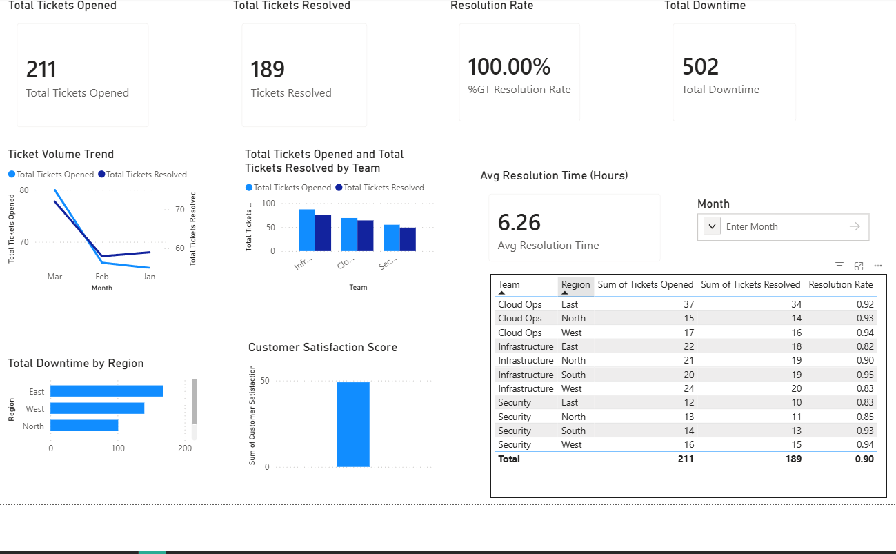
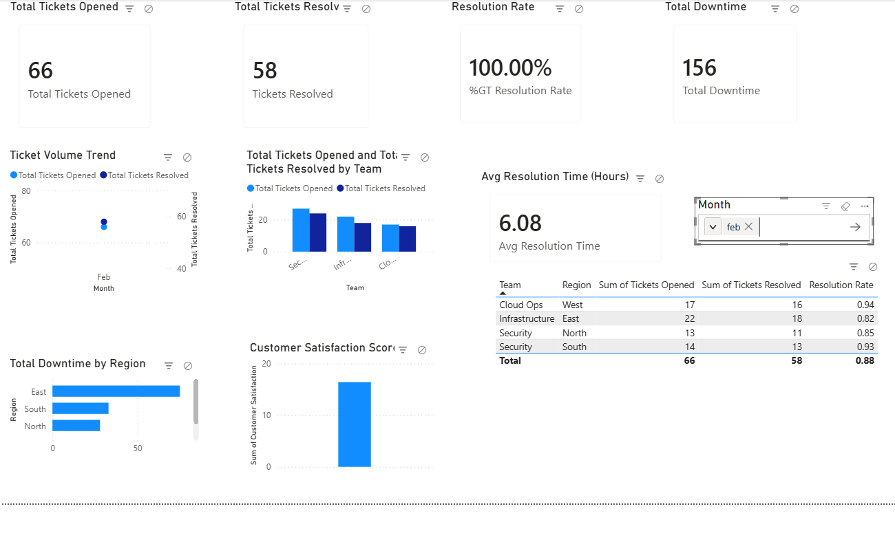

# powerbi-it-operations-dashboard
Interactive Power BI dashboard analyzing IT operations, ticket trends, downtime, and performance metrics.
## Dashboard Preview

# IT Operations Performance Dashboard

## Overview
This project is an interactive Power BI dashboard designed to analyze IT operations performance, including ticket volume, resolution efficiency, downtime, and customer satisfaction.

## Objectives
- Track ticket volume trends over time
- Compare team performance (tickets opened vs resolved)
- Identify regions with high downtime
- Monitor resolution efficiency and customer satisfaction
- Enable interactive filtering using slicers

## Tools Used
- Power BI Desktop
- DAX (Data Analysis Expressions)
- Excel (data source)

## Key Metrics (KPIs)
- Total Tickets Opened
- Total Tickets Resolved
- Resolution Rate
- Total Downtime
- Average Resolution Time

## Features
- Interactive slicer filtering (Month)
- Trend analysis (line chart)
- Team performance comparison
- Regional downtime analysis
- Detailed data table for deeper insights

## Insights
- Ticket volume trends fluctuate over time, with peak activity observed in specific months
- Some teams handle higher ticket loads but maintain strong resolution rates
- Certain regions experience higher downtime, indicating potential operational inefficiencies
- Resolution rate remains consistently high, indicating effective ticket handling

## Files Included
- `it-operations-performance-dashboard.pbix`
- `it_operations_dashboard_data.xlsx`
- Dashboard screenshots
